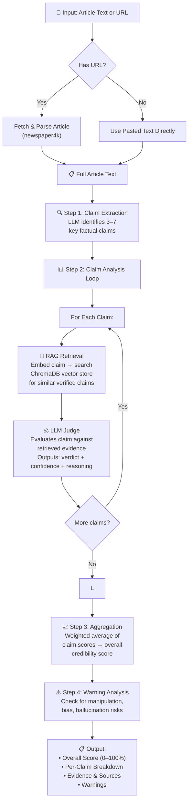
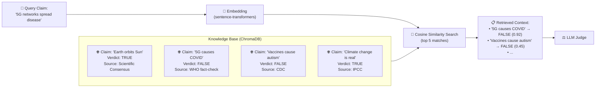

# Truth Lens — Flow Charts & Storyboard

## High-Level Pipeline



## RAG Retrieval Detail



## User Journey (Storyboard)

```
┌─────────────────────────────────────────────────────┐
│                 1. HOME SCREEN                       │
│                                                     │
│   ┌─────────────────────────────────────────────┐   │
│   │  Paste article text here...                  │   │
│   │                                              │   │
│   │                                              │   │
│   ├─────────────────────────────────────────────┤   │
│   │              OR                              │   │
│   ├─────────────────────────────────────────────┤   │
│   │  https://example.com/article                │   │
│   ├─────────────────────────────────────────────┤   │
│   │         🔍 Analyze Article                   │   │
│   └─────────────────────────────────────────────┘   │
└─────────────────────────────────────────────────────┘
                            │
                            ▼
┌─────────────────────────────────────────────────────┐
│                 2. LOADING STATE                     │
│                                                     │
│   🔄 Analyzing...                                   │
│   Extracting claims...                              │
│   Cross-referencing knowledge base...                │
│   Evaluating...                                     │
└─────────────────────────────────────────────────────┘
                            │
                            ▼
┌─────────────────────────────────────────────────────┐
│              3. RESULTS SCREEN                       │
│                                                     │
│   ┌─────────────────────────────────────────────┐   │
│   │  Overall Credibility Score:    ████████░ 78% │   │
│   │  LIKELY CREDIBLE                              │   │
│   │  3 claims true, 1 misleading                  │   │
│   └─────────────────────────────────────────────┘   │
│                                                     │
│   ⚠️ Warnings: Emotional language detected          │
│                                                     │
│   Claim 1: "The vaccine is 95% effective"           │
│   Verdict: ✅ TRUE (92% confidence)                 │
│   Evidence: CDC clinical trial data                 │
│                                                     │
│   Claim 2: "The government is hiding the truth"     │
│   Verdict: ⚠️ MISLEADING (60% confidence)           │
│   Explanation: No evidence supports this claim...   │
│                                                     │
│   [← New Analysis]                                  │
└─────────────────────────────────────────────────────┘
```
