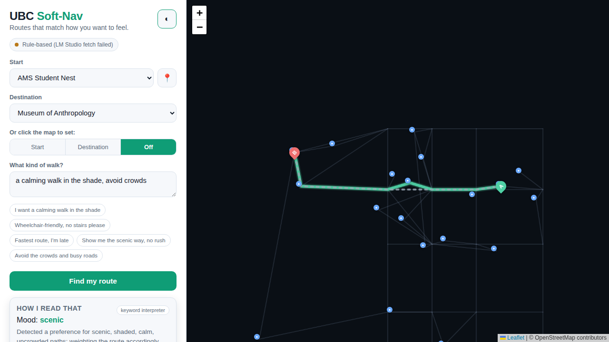

# UBC Soft-Nav 🌿🧭

A campus navigation app that routes by **how you want to feel**, not just the
shortest line. Type a destination and a plain-English wish — *"I want a calming
walk in the shade, avoid crowds"* — and the app interprets that into structured
navigation parameters, then finds a route over a UBC walking graph that matches.

> A prototype exploring **soft-constraint pathfinding** + an **LLM interpretation
> layer**, including the ethics of subjective routing.



---

## What it does

1. **Pick a start and destination** — from the dropdowns, by clicking the map, by
   clicking a landmark pin, or with "📍 use my location" (snaps to the nearest
   campus point).
2. **Describe the walk you want** in natural language.
3. **The interpreter** turns that text into weighted parameters —
   `scenic`, `shade`, `quiet`, `accessible`, `avoidBusy`, plus an `efficiency`
   (how much you want the shortest route). It uses, in order of availability:
   - **A local model via LM Studio / Ollama** (any OpenAI-compatible server),
   - **Claude** (Anthropic API), if a key is set,
   - **A deterministic keyword interpreter** that always works offline.
4. **A weighted router** (Dijkstra over the campus graph) finds the path whose
   character best matches your weights.
5. **The map and panel** show the route, an optional **fastest-route comparison**
   (*"+290 m for a shadier, calmer walk"*), **turn-by-turn directions**, how your
   words were read, and honest **warnings**.

You can then **fine-tune with sliders**, **toggle the fastest route**, switch
**light/dark**, and **copy a shareable link** (all state lives in the URL — nothing
is stored server-side).

### Example constraint → parameter translations

| You say | Interpreted as | Route effect |
|---|---|---|
| "Fastest route, I'm late" | `efficiency: 0.95`, no soft prefs | Shortest path (busier East Mall) |
| "Calming walk in the shade, avoid crowds" | `quiet, shade, avoidBusy ↑`, `efficiency: 0.35` | Detours onto the leafy, pedestrian **Main Mall** spine |
| "Show me the scenic way, no rush" | `scenic ↑`, `efficiency: 0.2` | Long way past gardens & landmarks |
| "Wheelchair-friendly, no stairs" | `accessible ↑` | Avoids stair shortcuts/trails; flat, step-free corridors |

---

## Run it

No build step. Leaflet is **vendored locally** (`public/vendor/`), so the only
runtime dependency for the app itself is Node.

**One command** (installs deps if needed, detects LM Studio, opens your browser):

```bash
./start-local.sh                    # auto
./start-local.sh --model <id>       # force a specific LM Studio model
PORT=8080 ./start-local.sh          # custom port
```

Or manually:

```bash
npm install        # only needed to refresh the vendored Leaflet copy
node server.js     # -> http://localhost:3000
```

The startup log and the in-app badge tell you which interpreter is live.

### Record a demo GIF

```bash
npm i -D playwright && npx playwright install chromium   # one-time
npm run demo                                             # -> docs/demo.gif (needs ffmpeg) or docs/demo.webm
```

`scripts/demo.mjs` drives a scripted walkthrough (calming walk → fastest-route
comparison → slider tweak → new destination → accessibility request → theme
switch) and, if `ffmpeg` is on your PATH, encodes it to `docs/demo.gif`.

### Use your local model (LM Studio + Gemma)

1. In **LM Studio**, load your model (e.g. `google/gemma-4-e4b`) and start the
   **local server** (Developer tab → Start Server). It listens on
   `http://localhost:1234/v1` by default.
2. Start Soft-Nav — by default it auto-detects LM Studio:

   ```bash
   node server.js
   ```

   To force it and/or set the exact model id LM Studio reports:

   ```bash
   LLM_PROVIDER=lmstudio \
   LMSTUDIO_MODEL="google/gemma-4-e4b" \
   node server.js
   ```

The app probes `GET /v1/models` on startup; when reachable the badge shows
**"Local model: …"**. If the model id is wrong the call falls back to the keyword
interpreter — check the exact id shown in LM Studio and pass it via
`LMSTUDIO_MODEL`.

### Configuration (environment variables)

| Variable | Default | Purpose |
|---|---|---|
| `PORT` | `3000` | Server port |
| `LLM_PROVIDER` | `auto` | `auto` \| `lmstudio` \| `claude` \| `rules` |
| `LMSTUDIO_BASE_URL` | `http://localhost:1234/v1` | OpenAI-compatible endpoint |
| `LMSTUDIO_MODEL` | `google/gemma-4-e4b` | Model id to request |
| `ANTHROPIC_API_KEY` | — | Enables the Claude backend |
| `INTERPRET_MODEL` | `claude-haiku-4-5-20251001` | Claude model id |

---

## How it's built

```
start-local.sh       One-command launcher (deps, LM Studio detection, opens browser)
server.js            Zero-dependency HTTP server: serves the app + /api/interpret + /api/health
lib/interpret.js     Multi-backend interpreter (LM Studio / Claude / rules), shared JSON schema
scripts/demo.mjs     Records a walkthrough -> docs/demo.gif (Playwright + ffmpeg)
tests/smoke.mjs      Dependency-free tests (npm test)
public/
  index.html         UI shell
  styles.css         Light/dark themed UI
  graph.js           Curated UBC campus graph (malls + landmarks) with path attributes
  router.js          Weighted Dijkstra + turn-by-turn directions + nearest-node snapping
  map.js             Leaflet view (network, POIs, route, fastest overlay, click-to-set)
  api.js             Client for /api/interpret and /api/health
  app.js             Orchestration: pickers, sliders, sharing, theme
  vendor/            Vendored Leaflet (no CDN dependency)
```

**The cost function** is what makes the same start/destination produce different
routes for different vibes:

```
penalty = wScenic·(1−scenic) + wShade·(1−shade) + wQuiet·(1−quiet)
        + wAccessible·(1−accessible) + wAvoidBusy·busy
cost    = distance × (1 + detourScale · penalty)
```

`detourScale` grows as `efficiency` drops, so a hurried user tolerates little
detour while a wanderer tolerates a lot. A strong accessibility need additionally
gates near-impassable paths (e.g. the forest stair trail) so they're avoided, not
just penalized.

> The campus graph is **approximate** — a coherent grid of the malls plus real
> landmarks, accurate enough to demo the concept and look right on the map, not a
> survey-grade dataset.

---

## Ethics built into the UX

This prototype deliberately surfaces the risks of subjective routing rather than
hiding them — matching the project brief's ethical topics:

- **Subjectivity is shown, not assumed.** The panel always displays *how your words
  were interpreted* (weights + rationale) so a misread is visible and correctable.
- **Quiet ≠ safe.** A strong "quiet" preference auto-attaches a warning that calm
  paths can also be isolated — the autonomy/reliability risk of routing someone
  alone through an empty area.
- **No tracking.** No account, no database, no movement log. Requests go to the
  server only to interpret the constraint; routing runs in your browser, and
  shareable links encode state in the URL, not on a server. Running the
  interpreter on a **local** model (LM Studio) means your words never leave your
  machine at all.
- **Whose "nice"?** A model's idea of scenic/calm reflects its training data and
  whoever set the path attributes. The UI frames suggestions as a starting point,
  not ground truth.

---

## Limitations & next steps

- Approximate, hand-built graph — swap in real OSM pedestrian data + elevation for
  true accessibility grading.
- `busy`/`shade` are static presets — no live crowding, weather, or construction.
- Directions are corridor-level, not metre-by-metre turn instructions.
- The rule-based fallback is keyword-level; the LLM layer handles nuance far better.
```
